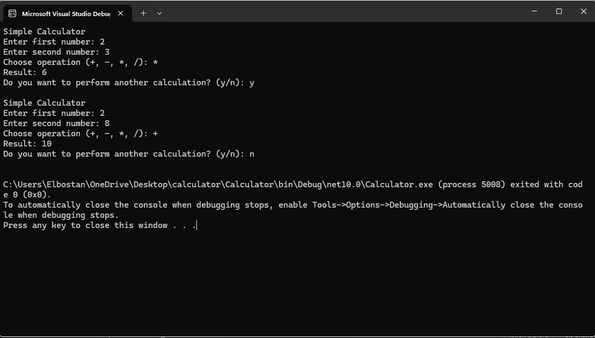

# Calculator

A simple console calculator built with C# and .NET.

## Features

- Addition
- Subtraction
- Multiplication
- Division
- Handles invalid input
- Handles division by zero
- Allows multiple calculations without restarting the application

## Technologies

- C#
- .NET

## How to Run

```bash
dotnet run --project Calculator
```

## Screenshot


